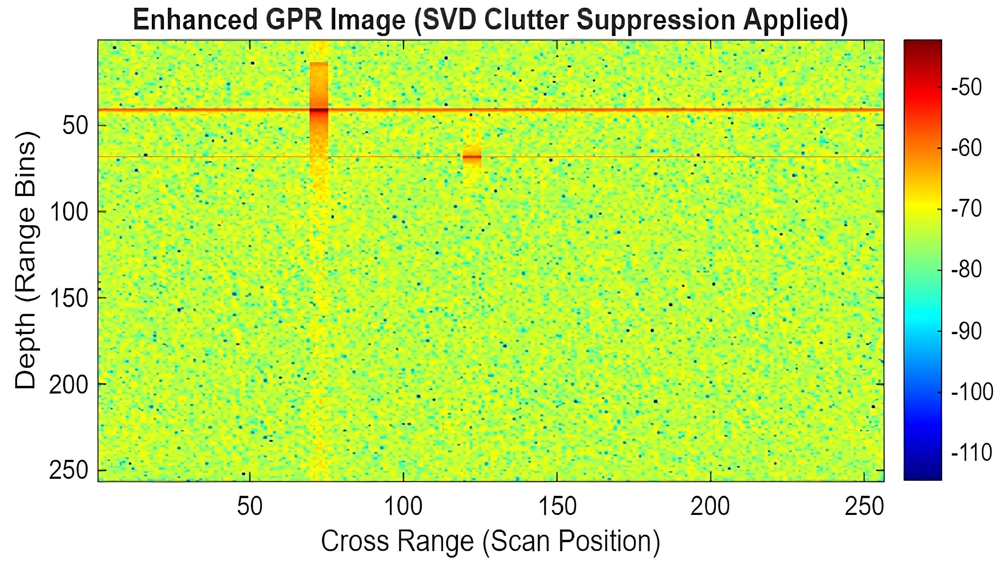

# GPR Signal Simulation with SVD Clutter Suppression (MATLAB)

MATLAB simulation of a stepped-frequency Ground Penetrating Radar (GPR) that
generates a B-scan with a dominant ground reflection and two buried targets,
then removes the ground clutter using Singular Value Decomposition (SVD).

Developed during a 45-day internship at Defence Laboratory Jodhpur (DRDO),
June-July 2026, on "Signal Simulation and Modelling for GPR Application".

## How it works
1. **Radar model:** received power for the ground and each target from the radar range equation.
2. **Signal generation:** stepped-frequency returns with phase delay `exp(-j4*pi*f*d/c)` for each depth.
3. **Noise:** thermal noise from `k*T*B` with a 5 dB noise figure.
4. **Imaging:** inverse FFT (`ifft`) across frequency to form the range profile, plotted as a B-scan in dB.
5. **Clutter suppression:** SVD of the B-scan. The first singular value holds the uniform ground reflection, so it is dropped and the image is rebuilt from the remaining components.

## Parameters
| Parameter | Value |
|---|---|
| Centre frequency | 1 GHz |
| Bandwidth | 200 MHz |
| Frequency steps | 256 |
| Transmit power | 1 W |
| Antenna gain (Tx / Rx) | 10 dB each |
| Target depths | 30 m and 50 m (ground at 10 m) |
| Noise figure | 5 dB |

## Result
Raw B-scan: the ground reflection dominates the top of the image and hides the
targets. After SVD clutter suppression: the ground band is removed and two
localized target responses appear without visible distortion.

## Run
Open `gpr_svd_clutter_suppression.m` in MATLAB and press Run. Two figures open:
the raw GPR image and the SVD-enhanced image.

## Author
Rajat Tak - B.Tech Electronics Engineering, NIELIT Aurangabad
